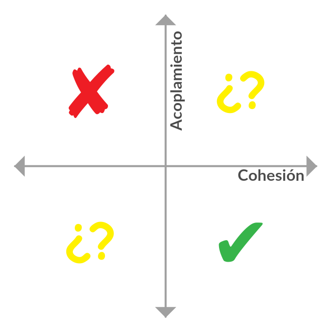

# Características de POO

Los siguientes conceptos que vamos a ver, son características que tiene un buen diseño orientado a objetos, si bien este paradigma no garantiza dichas características, hace mucho más fácil poder lograrlas y en cierta manera nos obliga a usarlas.

## Abstracción

La abstracción es la propiedad de los objetos que consiste en tener en cuenta sólo los aspectos más importantes desde un punto de vista determinado y no tener en cuenta otros aspectos. Durante el proceso de abstracción es cuando se decide qué características y comportamientos debe tener el modelo para asi reducir su complejidad. De este modo, las características complejas se hacen más manejables.

**Ejemplo:**

En POO, podemos considerar una Persona como un objeto que tiene propiedades \(como nombre, altura, peso, color de pelo, color de ojos, etcétera\) y métodos \(como hablar, mirar, andar, correr, parar, etcétera\). Gracias a la abstracción, otro objeto Tren puede manipular objetos del tipo Persona sin tener en cuenta sus propiedades ni métodos ya que sólo le interesa, por ejemplo, calcular la cantidad de personas que están viajando en él en ese momento, sin tener en cuenta ninguna otra información relacionada con dichas personas, tales como la altura, el nombre, el color de ojos, etcétera. Nuestro objeto Tren se abstrae de objetos del tipo Persona.

## Ocultamiento de la información

Este concepto hace referencia a que los componentes se deben utilizar como si sólo se conocieran su interfaz y no se tuviera conocimiento de su implementación. En otras palabras, un objeto sabe que otro objeto entiende un determinado mensaje, el cual recibe ciertos parámetros y devuelve algo \(o no\).

**Ejemplo:**

Yo como objecto médico quiero saber cuantas cirugías tuvo un paciente, y entonces le envía un mensaje para que el paciente me devuelva el número de cirugías que tuvo. El objeto médico no sabe como devolvió ese número el Paciente, solo sabe que tiene que enviarle el mensaje y recibir un número.

## Encapsulamiento

Encapsulamiento es la capacidad de diferenciar qué partes de un objeto son parte de la interfaz y cuales permanecerán inaccesibles por el usuario. Son los lenguajes de programación los cuales, por medio los modificadores de acceso, permiten indicar el modo de accesibilidad de un componente.

En POO, a la conjunción de abstracción y ocultamiento de implementación se la llama **encapsulamiento**.

Según Booch, encapsulamiento “... es el proceso de almacenar en un mismo comportamiento los elementos de una abstracción que constituyen su estructura y su comportamiento; sirve para separar la interfaz contractual de una abstracción y su implementación”.

Veamos si se entiende con un ejemplo:

```text
class Guerrero{
    attribute vitalidad
}
class Monstruo {
    method atacar(Guerrero barbaro){
        barbaro.vitalidad = barbaro.vitalidad - 10
    }
}
```

En este caso, el monstruo cuando ataca al guerrero lo debilita, cambiando el valor de la propiedad vitalidad directamente. Obviamente si escribimos una implementación como esta va a funcionar, pero existen diferentes razones por las cuales no nos conviene hacerlo así.

A nivel conceptual, nuestro objeto monstruo, no tiene porque conocer como el bárbaro maneja su vida, este podría hacerlo simplemente con un valor numérico o mismo con otro tipo de objeto. El monstruo solo tiene que mandar el mensaje y es ya cuestión del bárbaro entenderlo y accionar en base a ello.

Viéndolo desde el punto de vista de la escalabilidad y de un lenguaje de programación, si el día de mañana tenemos diferentes objetos que tiene que modificar dicha propiedad, nuestro código se puede volver difícil de cambiar debido a que en varias partes se usar la propiedad vitalidad \(por ejemplo supongamos que ahora manejamos la vitalidad con un objeto Vida\), si tenemos encapsulado ese comportamiento, solo vamos a tener que hacer un cambio en un solo lado.

Una forma más amigable de hacer esto sería:

```text
class Guerrero {
    attribute vitalidad
    method recibirAtaque(int puntuacionDeAtaque){
        self.vitalidad = self.vitalidad - puntuacionDeAtaque
    }
}

class Monstruo {
    attribute puntuacionDeAtaque
    method atacar(Guerrero barbaro){
        barbaro.recibirAtaque(puntuacionDeAtaque)
    }
}
```

## Cohesión y Acoplamiento

La cohesión mide la relación entre el concepto que deseamos modelar y las responsabilidades del componente que lo representan. El acoplamiento mide qué tan relacionados están los componentes del sistema entre sí y cómo esa dependencia provoca un diseño.

Siempre buscaremos tener un bajo acoplamiento y que los objetos sean lo más cohesivos posible.

Claramente se puede ver que ambos conceptos están inversamente relacionados, nuestros diseños tienen que tener una alta cohesión y un bajo acoplamiento. El paradigma de objetos se basa en esta regla para generar diseños más sencillos, y al mismo tiempo fáciles de programar, probar y mantener.



## Declaratividad y Expresividad

Estos conceptos no son particulares de POO, pero aun asi se nos olvidan, por eso les vamos a hacer un repaso.

La **expresividad** tiene que ver con qué tan claro es el código, qué tanto expresa lo que tenías en la cabeza cuando lo escribiste, es decir, que tan bien expresadas están las ideas del programador. Usar variables y métodos con nombres que representan lo que son o hacen, es forma fácil de aplicar expresividad que no tiene nada que ver con el paradigma sino con el programador.

Por lo general la **declaratividad** ayuda a que el código sea más expresivo, porque no se mezcla el algoritmo con lo que querés que haga más a alto nivel. Cuando tenemos un código bien declarativo, podemos entender que es lo que hace sin ver en detalle el algoritmo implementado. Es importante recalcar que la declaratividad es contrario a la imperatividad \(osea, detallar linea a linea los pasos que hace el algoritmo\).

Entonces, la declaratividad indica que se hace y la expresividad muestra la intención de lo que el código que se va hacer.

Recordemos una frase de Martin Fowler que vale la pena comentar: “_Cuando sientas la necesidad de escribir un comentario, intenta primero refactorizar el código de manera que cualquier comentario se convierte en innecesario._”

**Ejercicio**

¿Qué les parece que hace este método?

```text
method ElementoNuevo (var parametro1){
    if(parametro1.tipo = “R”){
        var numero = coleccion1.count()
        self.coleccion1[numero +1] = parametro1
    }else{
        var numero = coleccion2.count()
        self.coleccion2[numero +1] = parametro1
    }
}
```

¿Qué les parece que hace este otro método?

```text
method Agregar(Soldado soldado){
    if(soldado.esDeReserva()){
        self.reservaDeEjercito.Add(soldado)
    }else{
        self.ejercito.Add(soldado)
    }
}
```

Claramente en el segundo ejemplo se entiende bien que estamos manejando un ejército y que nuestro método quiere agregar un nuevo soldado dependiendo de su tipo al ejército que luchara o al ejército de reserva.

Si tuviésemos que manejar modificar el primer método, tendríamos que hacer un análisis más profundo, revisando en el resto de nuestra aplicación qué significa la letra “R” en el tipo de soldado y para qué sirve la coleccion1 y coleccion2.

La expresividad y declaratividad son muy importantes para poder generar un código autodocumentado, ya que nunca sabemos en el futuro quienes van a tener que revisar nuestro código. Si un compañero que tiene que modificar nuestro código el día de mañana y no logra comprender fácilmente que quisimos hacer, entonces ahi tenemos un problema. Ahora, si nosotros mismos volvemos a un código que escribimos y no lo entendemos, entonces tenemos un grave problema.

