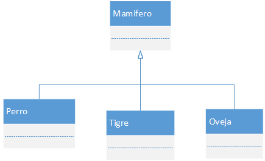
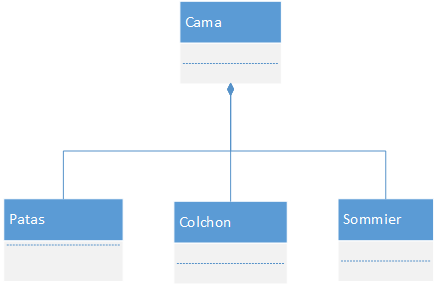

# Herencia y Composición

## Sobrecarga de métodos

La sobrecarga es la capacidad de un lenguaje de programación, que permite nombrar con el mismo identificador diferentes variables u operaciones.

La sobrecarga de métodos se refiere a la posibilidad de tener dos o más métodos con el mismo nombre pero diferente firma. El compilador usará una u otra dependiendo de los parámetros usados.

El mismo método dentro de una clase permite hacer cosas distintas en función de los parámetros.

**Ejemplo**

```text
class Articulo {
    private attribute precio
    public method setPrecio() {
        precio = 3.50
    }
    public method setPrecio(Currency nuevoPrecio) {
        precio = nuevoPrecio
    }
}
```

En este ejemplo que vemos, uno podría invocar al método "setPrecio" enviando un precio o sin parámetros, dependiendo como se invoque en nuestro código, el compilador decidirá si llama a la primer implementación o a la segunda.

En tiempo de compilación, se buscan todas las llamadas a este método y según el tipo de los parámetros con los que se esté invocando y el objeto que puede o no devolver \(necesariamente son lenguajes de chequeo estático\), se determina a qué implementación llamará. Si la combinación de parámetros no es excluyente, el compilador falla.

Los multimethods, a diferencia de la sobrecarga, son un conjunto de métodos con la misma firma, pero que se pueden solapar, y se decide cuál ejecutar en tiempo de ejecución.

## Composición

La composición se refiere a la combinación de objetos simples para hacer objetos más complejos.

Los objetos a menudo pueden dividirse en tipos compuestos y componentes, y la composición puede considerarse como una relación entre estos tipos: un objeto de un tipo compuesto \(ej.: auto\) "tiene un" objeto de un tipo simple \(ej.: rueda\).

Considere la relación de un automóvil con sus partes, a saber: el automóvil tiene o se compone de objetos como el volante, asientos, caja de cambios y el motor. Esta relación podría definirse como una relación de composición.

Los objetos compuestos generalmente se expresan por medio de referencias de un objeto a otro. Tales referencias pueden ser conocidas como atributos, campos, miembros o propiedades y la composición resultante como tipo compuesto. Sin embargo, tener esas referencias no necesariamente significa que un objeto es compuesto. Sólo se llama compuesto, si los objetos de los que se refiere son realmente sus partes, es decir, no tienen existencia independiente.

## Herencia

Es el mecanismo por el cual un objeto se basa en otro objeto o clase, extendiendo la implementación para reutilizar el comportamiento.

Supongamos que los gatos y los perros, por ser cuadrúpedos, caminan de la misma manera:

```text
class Perro{
    public method caminar(){
        moverPataDelanteraDerecha()
        moverPataDelanteraIzquierda()
        moverPataTraseraDerecha()
        moverPataTraseraIzquierda()
    }
}

class Gato{
    method caminar(){
        moverPataDelanteraDerecha()
        moverPataDelanteraIzquierda()
        moverPataTraseraDerecha()
        moverPataTraseraIzquierda()
    }
}
```

Esto puede traer varias complicaciones:

* Cada vez que quiero agregar un cuadrúpedo, tengo que copiar las mismas 6 líneas de código \(y todos sabemos que cada 2 copy paste de código, muere un gatito\).
* Si por alguna razón todos los cuadrúpedos empiezan a caminar primero con la izquierda, tenemos que cambiarlo en N lugares.

Quisiera entonces, poner todo este comportamiento en algún otro lado, y poder llamarlo desde todos los cuadrúpedos. Esta es la verdadera motivación de la herencia. La de reutilizar código. Para eso, vamos a implementar el método en una superclase y todos los que hereden de esa superclase, podrán usarlo también.

```text
class Cuadrupedo{
    method caminar(){
        moverPataDelanteraDerecha()
        moverPataDelanteraIzquierda()
        moverPataTraseraDerecha()
        moverPataTraseraIzquierda()
    }
}

class Gato extends Cuadrúpedo{
    ...
}
```

### ¿Cómo funciona?

El compilador, cuando le llega un método a un objeto, hace lo siguiente: 1. Busco la implementación en la clase del objeto al que le llegó el mensaje \(Gato\) 2. Si no la encontré, busco en su padre \(en nuestro ejemplo Cuadrupedo\) 3. Repetir el paso anterior hasta que no haya más padres. 4. Si no encuentra ninguna implementación en todos los niveles, lanza una excepción.

A este mecanismo se lo conoce como **Method LookUp**.

Algo a destacar de la herencia es que las clases hijas van a heredar TODO lo que haya definido su superclase, tanto atributos como métodos. No puede heredarse sólo una parte.

Las motivaciones de utilizar herencia van a ser entonces:

* Reutilizar código.
* Generar una abstracción.
* Proveer un Tipo \(para lenguajes con tipado estático\).

## Herencia Vs Composicion

Uno de los objetivos que buscamos cuando programamos es reutilizar métodos y funcionalidades, para lograr una mayor mantenibilidad. Dentro de los lenguajes convencionales orientados a objetos existen varias formas de hacer esto, las dos más conocidas son: **herencia de clases** y **composición**.

### Herencia de clases

También conocido como “reutilización de caja blanca”, debido a la visibilidad que dan ya que mediante la herencia la implementaciones de las clases padres se hacen visible a las clases hijas.



**Ventajas**

* Se define en tiempo de compilación y no tiempo de ejecución, es decir que conocemos con seguridad que se va a ejecutar.
* Es más sencillo de modificar la implementación que está siendo reutilizada.

**Desventajas**

* Como dijimos antes, se definen en tiempo de compilación, por lo que no se puede cambiar el comportamiento de un objeto en tiempo de ejecución, lo cual puede ser un requisito de nuestro diseño.
* Se rompe el concepto de encapsulación al exponer los detalles de la implementación en la clase padre.

### Composición

Conocida como “reutilización de caja negra”, a diferencia del caso anterior nosotros no conocemos los detalles de la implementación, ya que la misma se encuentra encapsulada en el objeto al cual estamos invocando.



En el ejemplo, la cama está compuesta por patas, un colchón y sommier.

**Ventajas**

* Al tener objetos que hacen referencia a otros objetos, el vínculo se define en tiempo de ejecución y como a dichos objetos se accede mediante su interface no se rompe el principio de encapsulación \(entonces podríamos reemplazar al objeto por otro cuando corre nuestro programa y tener un comportamiento totalmente distinto!\).
* Permite tener clases más centradas y encapsuladas, haciendo que nuestro diseño tenga más objetos \(menos clases\) de menor tamaño y con menos responsabilidades.

### Conclusión

Se podría decir que conviene favorecer la composición por sobre la herencia, sin embargo esta respuesta no es definitiva, cada uno tiene que identificar la necesidades y el dominio en el cual está trabajando para identificar en casos conviene usar cada metodología.

### Algunas recomendaciones

* En lenguajes que no soportan herencia múltiple, puede resultar ventajoso la composición.
* La composición genera un diseño más desacoplado, que puede ayudar a hacer el testing \(o TDD\) mas fácil.
* Muchos patrones de diseño favorecen la composición.

